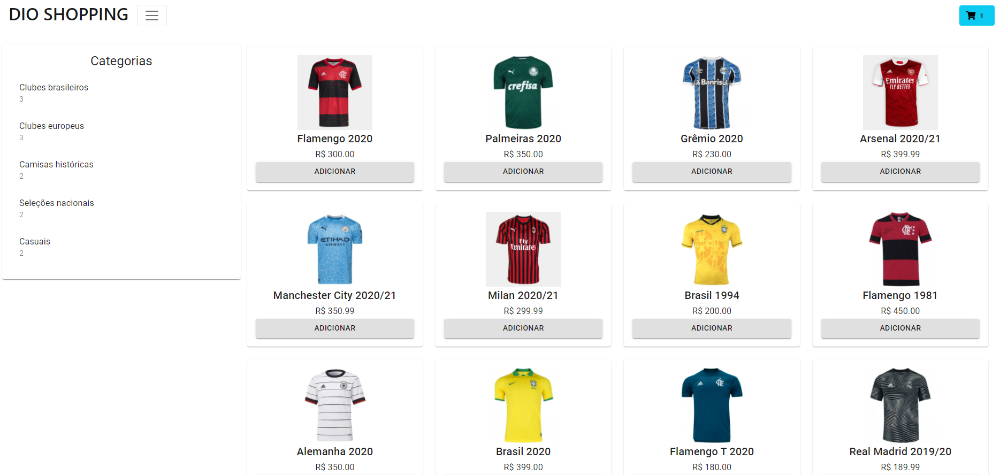
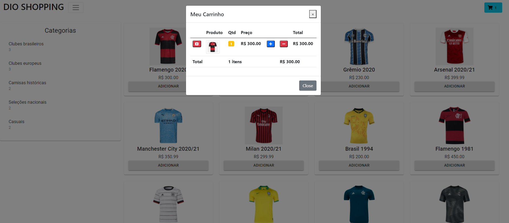

# DIO SHOPPING
Projeto de Integração Frontend e Backend de Ecommerce - Bootcamp Inter

* Projeto Final desenvolvido durante o Bootcamp Inter da plataforme Digital Innovation One. O projeto consiste na integração do Frontend e Backend de uma aplicação web de e-commerce. A reprodução do projeto contou com a utilização do framework ReactJs, NodeJS, bem como ferramentas como Hooks (useState e useEffect).

* Ademais, a integração também consistiu na utilização do SQLite como banco de dados.

 

